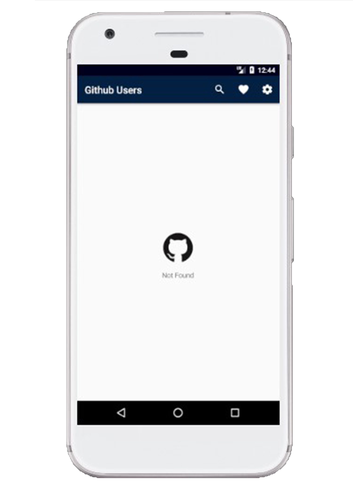
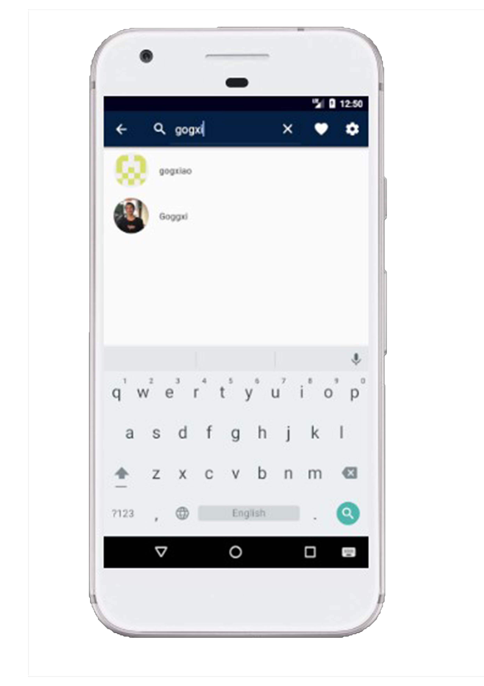
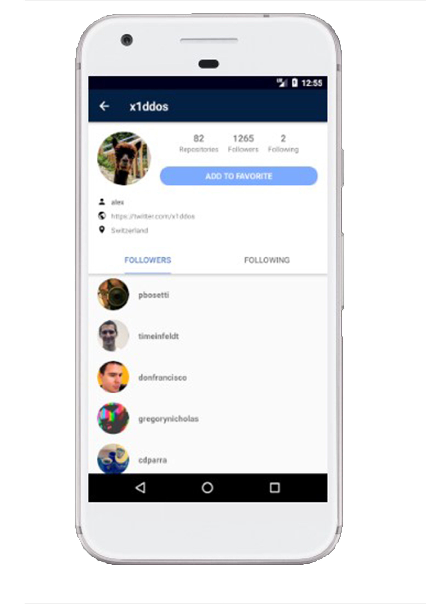
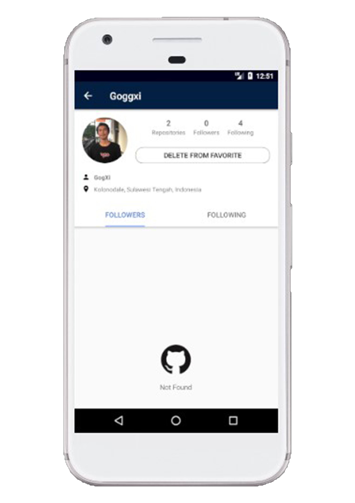
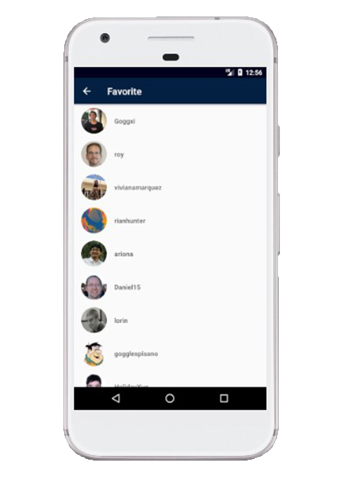
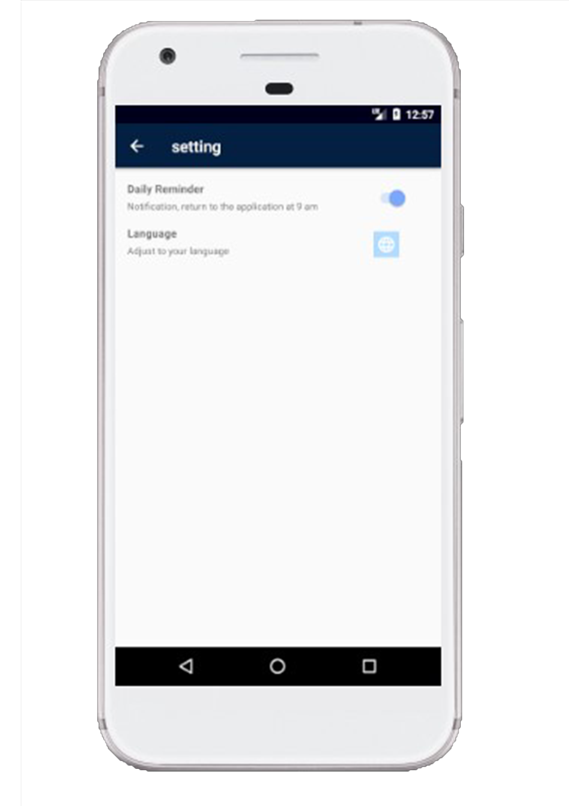

## Deskripsi

Project Gogxi-Github User adalah submission project untuk kelas [__Dicoding - Belajar Fundamental Aplikasi Android__](https://www.dicoding.com/academies/14).

Repository ini berisi source code submission 3 (FINAL).
Silahkan di clone, dan di jadikan sebagai Refrensi !!!

- [x] MVVM Arsitektur
- [x] Menggunakan Retrofit2 untuk parsing API
- [x] Localization (mendukung bahasa inggris dan indonesia)
- [x] Menggunakn Room Database untuk menyimpan data di local
- [x] Menggunakn Content Provider untuk mengirim data ke aplikasi lain
- [x] Daily reminder untuk kembali ke aplikasi yang berjalan pada pukul 09.00 AM

## Tampilan Aplikasi

  
  
  
  
  
  

​